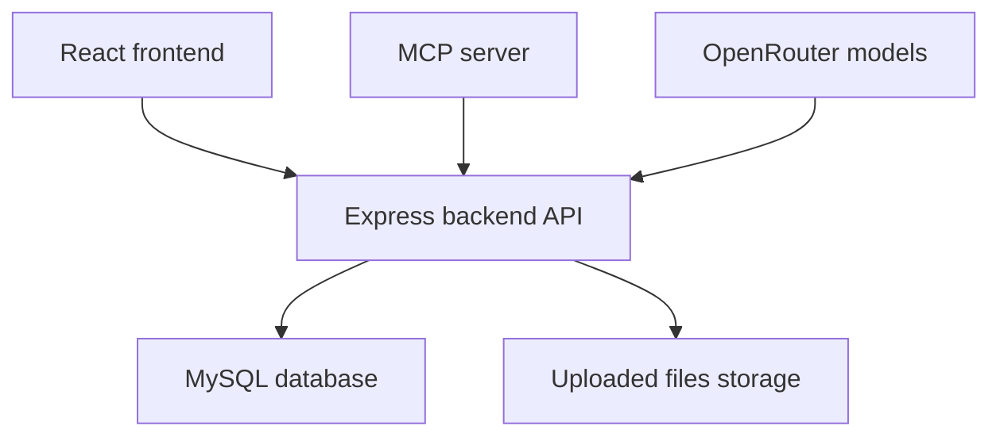
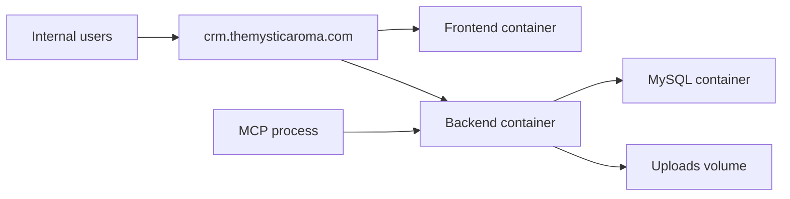
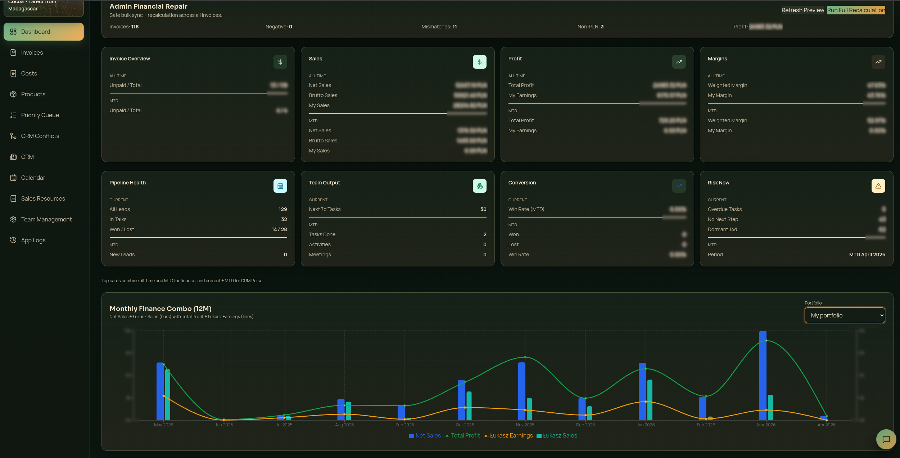
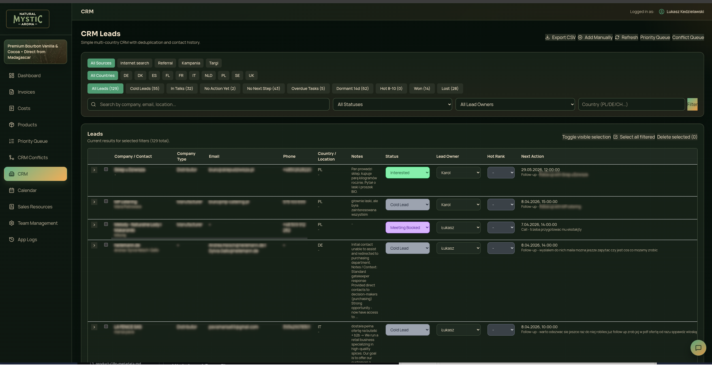
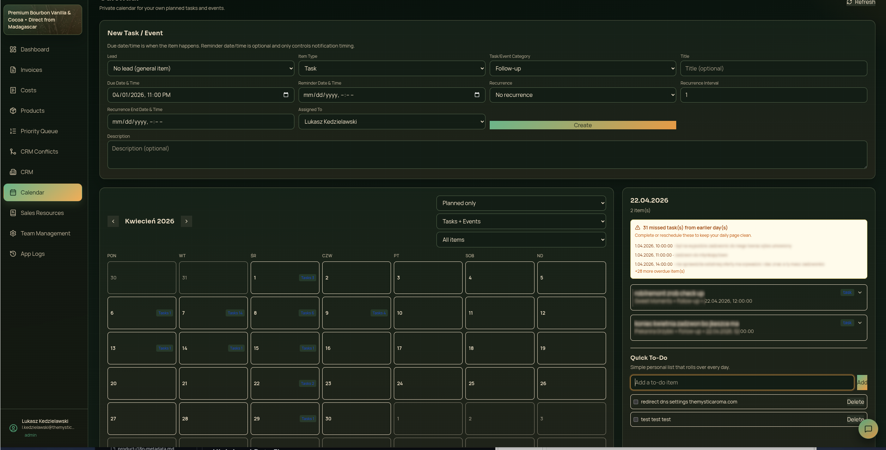
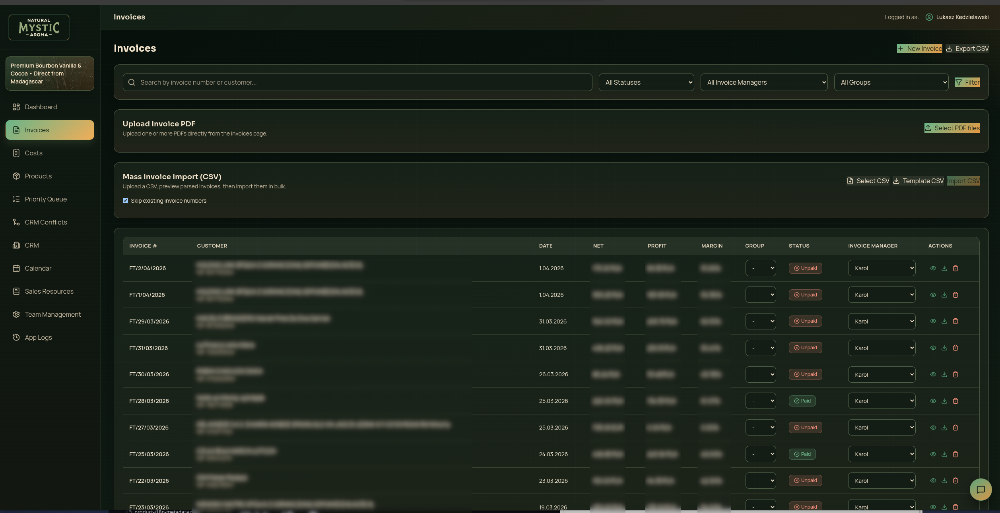
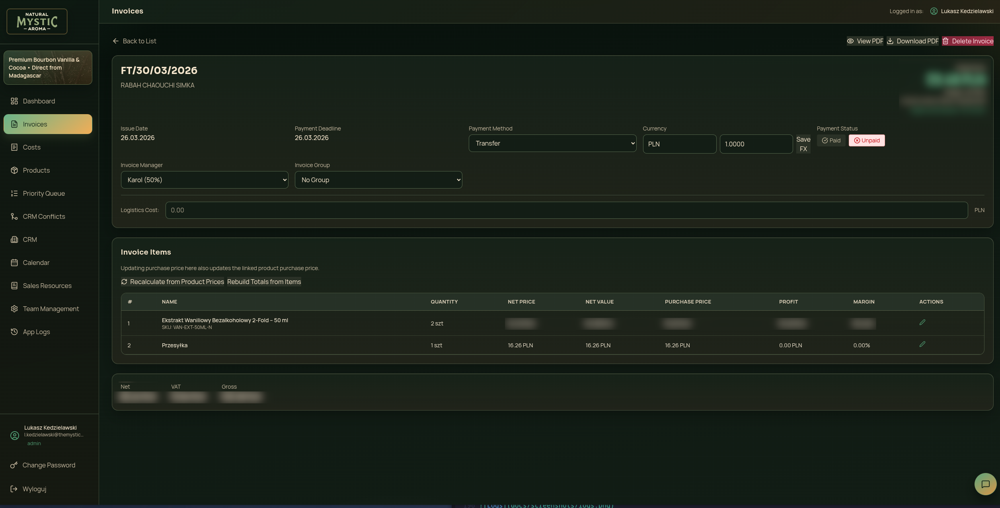
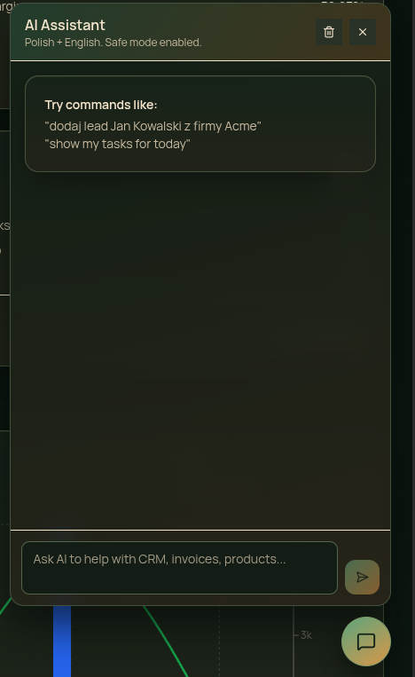
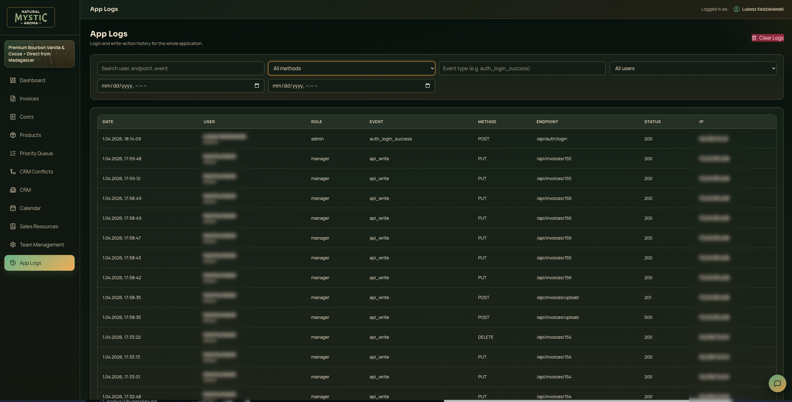

# Natural Mystic Aroma — Internal CRM with AI chat, MCP server, and invoice automation

I built this for Natural Mystic Aroma because too much operational context was split across inboxes, spreadsheets, calendars, invoice folders, and memory. The running production app is used internally to keep CRM follow-ups, calendar work, invoice control, payouts, product pricing, grouped costs, and audit history in one place. This public repo is a sanitized documentation companion based on the real application code in `app/`.

## What It Does

At the center, this is a CRM and calendar for a product business.

It helps the team answer questions like:

- Which seller is moving deals forward and which one is stuck
- Which invoices are paid, overdue, partial, or need chasing
- How much margin the company is making on invoices and groups of invoices
- How much commission or payout is owed to account managers and team members
- Which tasks, calls, meetings, and follow-ups are due next
- Which products, pricing ladders, and offer snippets the team should use
- Who changed what inside the app and when

## Production Status

Live and in active internal use by the NMA team. Sanitized for public presentation - business-sensitive data and secrets removed. All screenshots use fabricated data.

## What I Built And Why

I didn't want a generic CRM that stored contacts but still forced the business to manage invoices, payouts, and next actions somewhere else. I built one internal system that keeps those workflows connected.

- CRM and calendar are together so leads, tasks, and meetings live in the same workflow instead of being split across tools.
- Invoice data is tied to products, account managers, grouped costs, and recalculation logic so finance decisions are based on actual transaction data.
- Sales resources and reusable email content live inside the app because offer quality and follow-up speed matter as much as raw lead volume.
- Audit logs and role-based access sit close to every write path because this app runs day-to-day operations, not just reporting.
- The AI route and separate MCP server let the system be queried and updated from natural language, but only through backend-validated actions.

## Stack

| Layer | Tech |
| --- | --- |
| Frontend | React 19, TypeScript, Vite, Tailwind, Recharts |
| Backend | Node.js, Express 5, TypeScript, Zod, Multer |
| Database | MySQL 8 / MariaDB-compatible schema |
| Files | Uploaded PDFs and documents stored by backend file services |
| AI | OpenRouter-backed chat route with action allowlist |
| MCP | Standalone MCP server in `app/mcp/` |
| Deployment | Docker Compose in `app/docker-compose.yaml` |

## Architecture

In plain language, the browser talks to one backend API. The backend owns authentication, validation, parsing, recalculation, permissions, and audit logging. MySQL stores the operational records. The MCP server is separate on purpose so AI tooling can call the same backend safely without becoming part of the main web app.



For deployment, the codebase is structured around the real app living in `app/`:



More detail: [`docs/architecture.md`](docs/architecture.md)

## What Makes It Non-Standard

- Most internal tools are either a CRM or a finance tool. This one connects both - a lead in the CRM links directly to the invoices, margins, and payouts that result from it.
- The invoice layer is not passive storage. The backend parses uploaded invoice PDFs and cost documents, then recalculates item profit, invoice margin, exchange-rate-adjusted values, and manager commission.
- Costs can be attached to invoice groups and linked back to specific invoices, which makes margin reporting closer to how the business actually operates.
- The CRM includes duplicate handling, handover requests, lead scoring, priority buckets, and task recurrence instead of a flat contacts table.
- AI actions are not direct model writes. The backend only exposes an allowlisted set of actions and logs blocked or forbidden attempts.
- The MCP package lets external AI tooling use the CRM safely through the same backend instead of bypassing business rules.

## Feature Map

| Area | What it covers | Main anchors |
| --- | --- | --- |
| Dashboard | Revenue, profit, payment, and owner-level summaries | `app/frontend/src/pages/DashboardPage.tsx`, `app/backend/src/routes/invoices.ts` |
| CRM | Leads, activities, ownership, dedupe, product interest, pipeline tracking | `app/frontend/src/pages/CrmPage.tsx`, `app/backend/src/routes/crm.ts`, `app/database/schema.sql` |
| Calendar | Tasks, events, reminders, recurrence, follow-up workflow | `app/frontend/src/pages/CalendarPage.tsx`, `app/backend/src/routes/crm.ts` |
| Invoices | Import, storage, profit, payment status, owner splits, PDF generation | `app/frontend/src/pages/InvoicesPage.tsx`, `app/backend/src/routes/invoices.ts`, `app/backend/src/services/invoiceRecalculation.ts` |
| Costs | Cost documents, parse preview, invoice-group linking, cost rollup | `app/frontend/src/pages/CostsPage.tsx`, `app/backend/src/routes/costs.ts`, `app/backend/src/services/costDocumentParser.ts` |
| Products | Catalog, tiers, recommended pricing, stock adjustments | `app/frontend/src/pages/ProductsPage.tsx`, `app/database/schema.sql` |
| Resources | Email offers, snippets, translations, file attachments | `app/frontend/src/pages/ResourcesPage.tsx`, `app/backend/src/routes/resources.ts` |
| Team management | Roles, access, account managers, password changes | `app/frontend/src/pages/UserManagementPage.tsx`, `app/frontend/src/utils/accessControl.ts`, `app/backend/src/routes/auth.ts` |
| Logs | Admin-only audit trail for application activity | `app/frontend/src/pages/LogsPage.tsx`, `app/backend/src/routes/logs.ts` |
| AI and MCP | Safe natural-language actions over CRM, invoices, products, customers | `app/backend/src/routes/ai.ts`, `app/frontend/src/components/AiChat/AiChat.tsx`, `app/mcp/src/index.ts` |

## Repository Layout

```text
.
├── README.md
├── docs/
│   ├── architecture.md
│   ├── decisions.md
│   ├── features.md
│   ├── code-tour.md
│   └── screenshots/
│       └── README.md
└── app/
    ├── backend/
    ├── frontend/
    ├── database/
    ├── mcp/
    ├── docker-compose.yaml
    └── .env.docker.example
```

## Running locally

I kept the local run path simple and close to production by documenting the Docker setup that lives inside `app/`. The main web app works without MCP. The MCP server is an optional integration layer for AI tooling.
```bash
cd app
cp .env.docker.example .env
docker compose up -d --build
```

Health check:
```bash
curl http://127.0.0.1:3001/api/health
```

To run the optional MCP server:
```bash
cd app/mcp && npm install && npm run build && npm start
```

To run services separately without Docker:
```bash
cd app/backend && npm install && npm run dev
cd app/frontend && npm install && npm run dev
```

That's it. Everything else is correct.

## Environment And Sanitization

- This public repo is sanitized for presentation.
- Real API keys, passwords, tokens, client data, and business-sensitive records are not included here.
- Environment variables in the actual app should use placeholders such as `${ENV_VAR}` when mirrored publicly.
- The included env examples use placeholder variables only and do not include live secrets.
- The Docker deployment expects `${APP_DOMAIN}` for host-based routing when used behind Traefik or another reverse proxy.

Core variables used by the application:

| Variable | Purpose | Where it comes from |
| --- | --- | --- |
| `${MYSQL_HOST}` / `${DB_HOST}` | Database host | local Docker or managed database |
| `${MYSQL_DATABASE}` / `${DB_NAME}` | Database name | local Docker or managed database |
| `${MYSQL_USER}` / `${DB_USER}` | Database user | local Docker or managed database |
| `${MYSQL_PASSWORD}` / `${DB_PASSWORD}` | Database password | local Docker or managed database |
| `${JWT_SECRET}` | Signs user sessions and service tokens | generated secret |
| `${DEFAULT_ADMIN_PASSWORD}` | First-run admin bootstrap | generated secret |
| `${CORS_ORIGIN}` | Allowed frontend origin | deployment config |
| `${VITE_API_URL}` | Frontend API base URL | frontend env |
| `${APP_DOMAIN}` | Public host used by reverse-proxy routing | deployment config |
| `${OPENROUTER_API_KEY}` | AI provider key | OpenRouter account |
| `${OPENROUTER_MODEL}` | Primary AI model | deployment config |
| `${MCP_API_URL}` | Backend API URL used by MCP | deployment config |
| `${MCP_API_TOKEN}` | Service token for MCP access | admin-issued token |


## Screenshots

All screenshots use fabricated data.

### Dashboard

Financial and pipeline dashboard showing all-time and MTD revenue, profit, weighted margins, team output, conversion rates and a 12-month finance combo chart. Includes CRM statistics, overdue meetings, recent actions, product stock and top-performing products.

### CRM pipeline

Multi-country lead pipeline with 129 active leads, status buckets, ownership, priority, deduplication queue, and per-lead notes. Filterable by country, source, and next action state.

### Calendar

Tasks, meetings and follow-ups with lead linkage and recurrence support. Quick to-do list with missed task reminders.

### Invoice list

Invoice table with payment status, profit, exchange rate adjustments and manager commission split across all records.

### Invoice detail

Per-invoice breakdown with item-level profit calculation, payment status, owner splits and recalculation history.

### AI chat

Natural language queries and actions over CRM and invoice data, routed through a backend action allowlist.

### Sales resources

Sales template library with categorized email offers, objection handlers and product pitches in multiple languages. Also stores company documents, certifications, spec sheets and product attachments accessible to the whole team.

### Team management

User accounts with role assignments and last login tracking. Account managers linked to login accounts with commission percentages used in invoice profit calculations.

### Audit logs

Invoice list with per-row profit and margin, payment status, manager assignment and invoice grouping. Supports PDF upload and bulk CSV import.


## Performance

I have not published Lighthouse scores or benchmark numbers in this repo because the app is authenticated and internal, and I do not want to claim metrics I have not captured and verified from a sanitized environment. When I prepare a public benchmark pass, I will add the measured results here.

## Code Reading Order

If you want to understand the custom parts first, start here:

1. `app/backend/src/routes/ai.ts`
2. `app/backend/src/services/pdfParser.ts`
3. `app/backend/src/services/costDocumentParser.ts`
4. `app/backend/src/services/invoiceRecalculation.ts`
5. `app/backend/src/routes/crm.ts`
6. `app/backend/src/routes/invoices.ts`
7. `app/database/schema.sql`

Full guide: [`docs/code-tour.md`](docs/code-tour.md)

## Documentation Index

- Architecture: [`docs/architecture.md`](docs/architecture.md)
- decisions: [`docs/decisions.md`](docs/decisions.md)
- Features: [`docs/features.md`](docs/features.md)
- Code tour: [`docs/code-tour.md`](docs/code-tour.md)
- Screenshots to capture: [`docs/screenshots/README.md`](docs/screenshots/README.md)

## License

MIT

## Contact

- Name: Lukasz Kedzielawski
- Email: lukasz@kedzielawski.com
- Website: [kedzielawski.com](https://kedzielawski.com)

