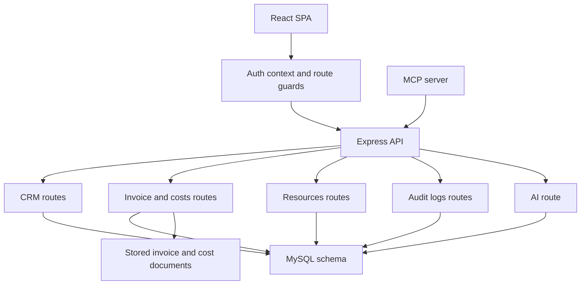
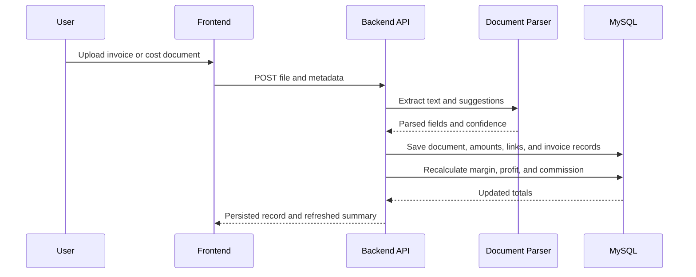
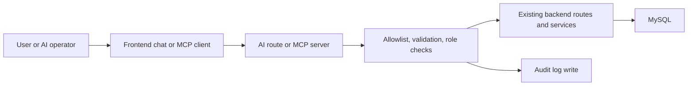

# Architecture

The architecture solves a practical problem: NMA needed one internal system where sales follow-ups, calendar tasks, invoice control, grouped costs, payouts, and internal resources all refer to the same records. I built the boundaries so each part has one clear responsibility and the finance logic stays server-side.

## Data Flow In Plain Language

An authenticated user works in the React frontend. The frontend sends requests to the Express API. The backend checks the user role, validates inputs, performs business logic, writes audit logs for important actions, and stores the result in MySQL. Uploaded files such as invoices or vendor documents are stored on disk and parsed by backend services before the parsed output is saved back to the database.

The AI and MCP paths do not bypass this flow. They still call the same backend and go through the same permissions and validation.

## Service Boundaries

### Frontend
Path: `app/frontend/`

I kept the frontend as a single authenticated SPA responsible for navigation, role-aware screens, and operator workflows. It does not calculate margin or parse documents locally. Those decisions stay on the backend.

Not all screens are visible to all users. Role-based navigation hides sections based on the logged-in user's role - sellers see CRM and calendar, bookkeeping sees invoices and costs, admins see everything including logs and team management. Data is also scoped by role - workers see only their own invoices and costs, admins see all records across the team.

Main anchors:
- `app/frontend/src/App.tsx`
- `app/frontend/src/components/Layout/Layout.tsx`
- `app/frontend/src/utils/accessControl.ts`

### Backend API

Path: `app/backend/`

The backend is the application core. It owns authentication, permissions, input validation, finance rules, document parsing, AI guardrails, and audit logging.

Main anchors:

- `app/backend/src/index.ts`
- `app/backend/src/routes/crm.ts`
- `app/backend/src/routes/invoices.ts`
- `app/backend/src/routes/costs.ts`
- `app/backend/src/routes/resources.ts`
- `app/backend/src/routes/logs.ts`
- `app/backend/src/routes/ai.ts`

### Database

Path: `app/database/`

The schema is intentionally broad because the app is not just a CRM. It stores users, account managers, products, invoices, grouped costs, CRM records, tasks, duplicate cases, resources, and audit logs in one relational model.

Main anchors:

- `app/database/schema.sql`

### File Storage

Path: backend-managed upload directories

I separated file storage from the database because invoices, generated PDFs, cost documents, and resource files are better handled as files with metadata saved in SQL.

Main anchors:

- `app/backend/src/services/fileStorage.ts`
- `app/backend/src/services/invoicePdf.ts`

### MCP Server

Path: `app/mcp/`

I kept the MCP server separate from the main API so external AI tooling can interact with the CRM without adding MCP concerns to the frontend or the core backend runtime. It uses the backend API instead of touching the database directly.

Main anchors:

- `app/mcp/src/index.ts`

## Application Architecture

## Finance And Document Flow

The finance flow is one of the more custom parts of the system. Invoice items inherit product purchase prices, invoices are recalculated in PLN-aware terms, and grouped costs can be attached after the invoice exists.

## AI And MCP Flow

I designed the AI path so the model never has direct write access. It can only request known actions, and the backend decides whether the action is allowed.

## Why These Boundaries Exist

- Frontend and backend are separate so permissions, parsing, and calculations stay enforceable server-side.
- Database tables are grouped by business function, but kept in one schema because CRM, invoices, tasks, and payouts depend on each other.
- File storage is separate because uploaded source documents need to remain accessible after parsing.
- MCP is separate because it is an integration surface, not part of the core web request cycle.
- AI actions route through backend rules because model output is not trusted input.
